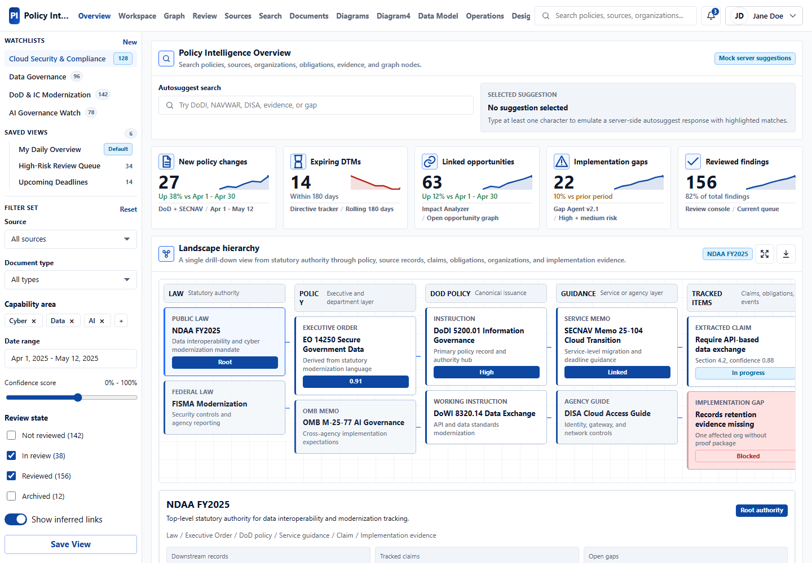
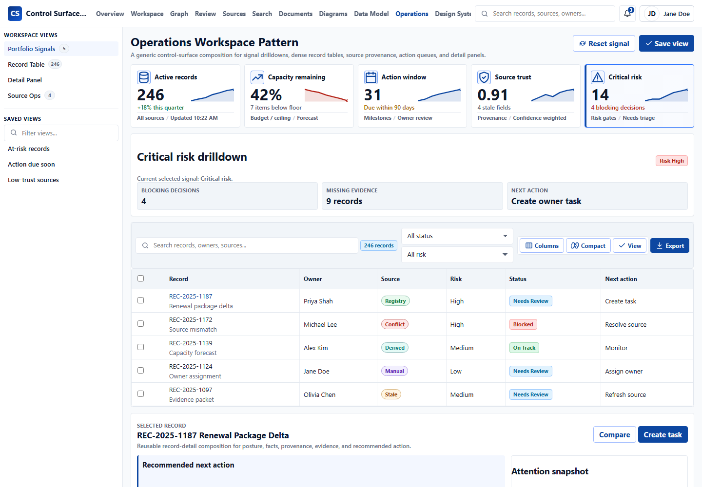
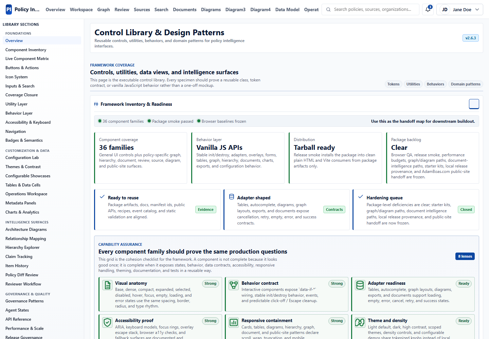
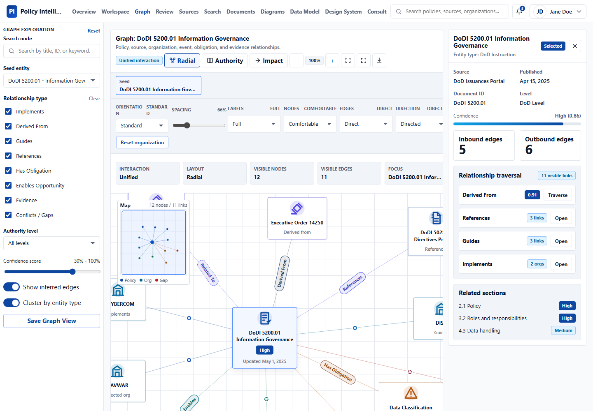
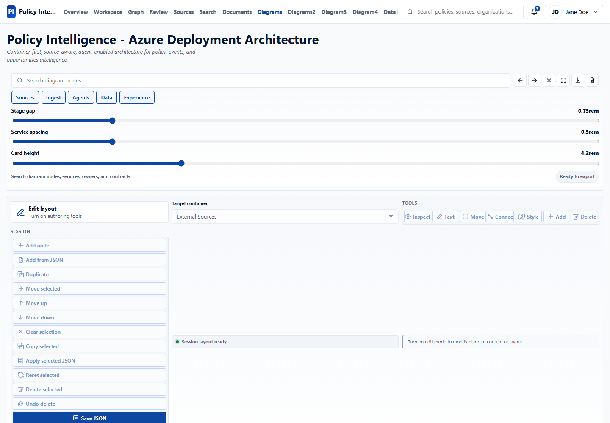
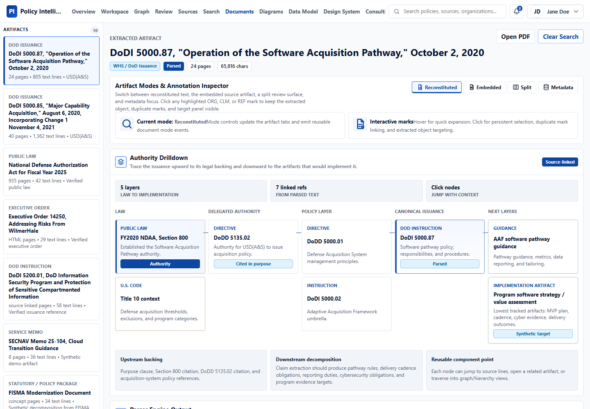

# Exemplar Control Surface Screenshots

These screenshots are captured from the framework's plain HTML examples using the compiled demo surface. They are intended for GitHub review, downstream handoff, and quick visual orientation before wiring components into a product.

## Gallery

| Surface | Screenshot | Demonstrates |
| --- | --- | --- |
| Overview control surface |  | Dense KPI scanning, left filters, record tables, contextual details, and enterprise shell controls. |
| Operations workspace |  | Generic operations queue patterns, command surfaces, action panels, and adaptable workspace composition. |
| Design system showcase |  | Component inventory, configuration surfaces, behavior samples, and framework readiness patterns. |
| Graph explorer |  | Relationship traversal, typed nodes, edge labels, filters, minimap, and contextual side panels. |
| Architecture diagram |  | Diagram primitives, lanes, stages, grouped services, connectors, and export-oriented layouts. |
| Document viewer |  | Artifact viewing, reconstituted text, annotations, extracted claims, references, and metadata panels. |

## Capture Notes

- Captured at `1440 x 1000` viewport from the local example server.
- Screenshots use the framework examples only; no React runtime is required.
- The gallery favors representative control surfaces over exhaustive component coverage. For full component coverage, use `examples/components.html` and `docs/component-manifest.json`.
